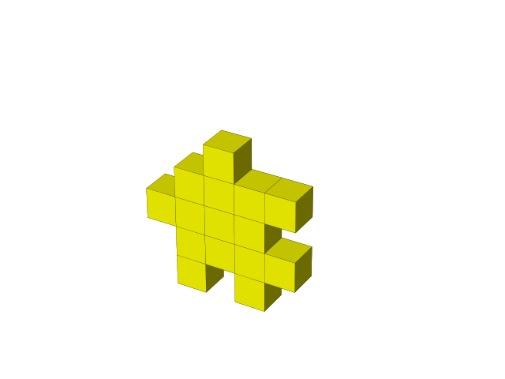
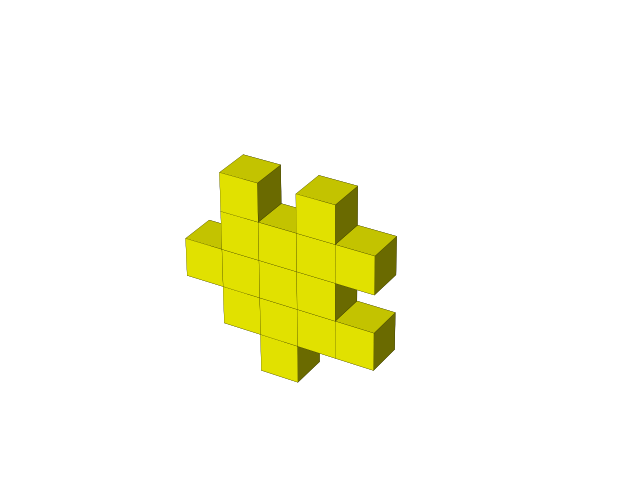

# Happy cube solver

In this project i use state-of-the art Integer programming software to solve large instances of Happy Cubes.

Happy cubes ([WIKI](https://en.wikipedia.org/wiki/Happy_Cube)) is an IQ toy best described as a 3d puzzle. The game consists of a set of bricks which should be put together in order to form a monocube or other larger polycubes = 3-dimensional polyominoes (See [Polycubes](http://kevingong.com/Polyominoes/Enumeration.html)).

The main motivation of this python project is to figure out the largest shape which can be formed by a set of Happy cube bricks.


$$ Bricks \sim \mathcal{B} = \{b^1, b^2, \ldots b^B\} $$
$$ Orientations \sim \mathcal{R} = \{r^1, r^2, \ldots r^8\} $$
$$ Cubits \sim \mathcal{R} = \{c^1, c^2, \ldots c^C\} $$
$$ Cubes \sim \mathcal{K} = \{k^1, k^2, \ldots k^K\} $$
$$ Faces \sim \mathcal{F} = \{f^1, f^2, \ldots f^F\} $$


### Bricks
Each brick is defined by a $5\times 5$ (0-1)-matrix.
e.g.


```console

   🟦  🟦  			[0, 1, 0, 1, 0]
  🟦🟦🟦🟦			[0, 1, 1, 1, 1]
🟦🟦🟦🟦  	defined by	[1, 1, 1, 1, 0]
  🟦🟦🟦🟦			[0, 1, 1, 1, 1]
  🟦  🟦🟦			[0, 1, 0, 1, 1]

  🟨  🟨  			[0, 1, 0, 1, 0]
🟨🟨🟨🟨  			[1, 1, 1, 1, 0]
  🟨🟨🟨🟨	defined by	[0, 1, 1, 1, 1]
🟨🟨🟨🟨  			[1, 1, 1, 1, 0]
    🟨    			[0, 0, 1, 0, 0]               
```

There are $6$ unique colors and $6$ bricks for each color.
 
### Faces

A set of connected cubes will form a polycube with a specific set of faces. Each face is uniquely defined by its center point coordinate (cubit). 

| | | |
|-|-|-|
|$1$ cube, 6 faces | $2$ cubes, $10$ faces | $4$ cubes, $16$ faces |


Here is a figure off all $5$ orientations of a yellow brick. For each brick i only consider the orientations that form unique cubegrids (ie. remove symmetries). I denote the reduces set of rotations of a brick $b \in \mathcal{B}$ by the set $\mathcal{R}(b)$.
| | | |  | |
|-|-|-|-|-|


## Recursive solver

A simple backtracking is implemented which easily solves the problem when considering a single cube. 


| | | |  | |
|-|-|-|-|-|
| | | |  | |


> TODO: The red one is missing as the data is wrong <30-07-24> >

A visualization of the recursive solver on a larger (intractable) instance:


| |   |
|-|-|


## Mathematical model

Here is a integer programming ([WIKI](https://en.wikipedia.org/wiki/Integer_programming)) model using the following 'incidens' parameter:

For each (valid) tuple $f,b,r,c \in \mathcal{F} \times \mathcal{B} \times \mathcal{R} \times \mathcal{C}$ let:
$$
\begin{align*}
A_{f,b,r,c} =
\begin{cases}
1, \quad \text{if cubit $c$ is covered by assigning brick $b$ in orientation $r$ on face $f$},
\\
0, \quad \text{otherwise}
\end{cases}
\end{align*}
$$


A mathematical model

$$
\begin{align}
	\min_x 1& \\
	\sum_{b \in \mathcal{B}}
	\sum_{r \in \mathcal{R}(b)}
	x_{f,b,r} &= 1
  ,\quad \forall f \in \mathcal{F} \\
	\sum_{f \in \mathcal{F}}
	\sum_{r \in \mathcal{R(b)}} 
	x_{f,b,r} & \le 1
  ,\quad \forall b \in \mathcal{B} \\
	\sum_{f \in \mathcal{F}}
	\sum_{b \in \mathcal{B}}
	\sum_{r \in \mathcal{R(b)}} 
	A_{f,b,r,c} \cdot x_{f,b,r} &= 1
  ,\quad \forall c \in \mathcal{C} \\
	x_{f,b,r} & \in  \{0,1\}, \quad \forall f \in \mathcal{F}, \forall b \in \mathcal{B}, \forall r \in \mathcal{R}(b)
\end{align}
$$


Short explenation of the model:
- (1) I minimize a constant as i simply want a feasible solution.
- (2) Each face must be covered by at least one (brick,orientation) pair.
- (3) Each brick can be used at most once, over orientations and faces.
- (4) For each cubit, exactly one (face,brick,orientation) combination must cover the cubit.
- (5) I require the decision variables to be binary. I was hoping that this constraint could be relaxed, however the model can find feasible solutions with fractional values. This is always true if the set of available bricks contain two identical bricks.


The model is implemented in the file `pyomo_implementation` and can be solved using the pyomo interface utilizing several different solvers such as `CPLEX` and `CBC`.

### Computational time

The recursive solution methods is clearly dominated by the use of IP solvers.

> TODO:  add results for different solvers <30-07-24>

## Main function

In the main program in loop throug a set of scenarios in order to find the larges possible polycube which can be formed by a specific set of bricks.

```console
input: set of bricks B

largest_n = 0
largest_F = ø
For each n = 1,2,...
  For each polycube F of size n: # Generated using github.com/mikepund/cubes 
    Setup the optimization problem P # from module pyomo_implementation
    if P is feasible:
      largest_n = n
      largest_F = F 
      goto next n

output: largest_n, largest_F

```


# The Answer

> TODO: The largest found solvable polycube <30-07-24> >


Resources:
* [Enumeration of polycubes](http://kevingong.com/Polyominoes/Enumeration.html)
* Code used for generating polycubes [Cubes Github](https://github.com/mikepound/cubes), See also the corrosponding [video on the number of Polycubes](https://www.youtube.com/watch?v=ojNDm8qKr9A)
* A guy making a large cube [Link](http://www.toinedegreef.nl/happy/)
